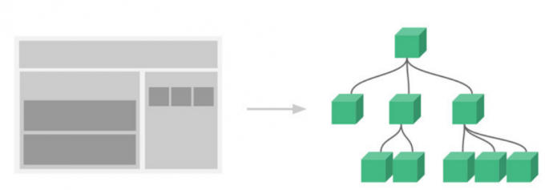
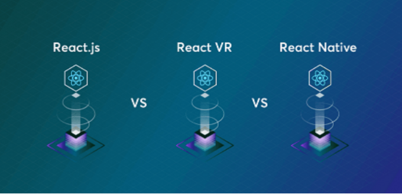
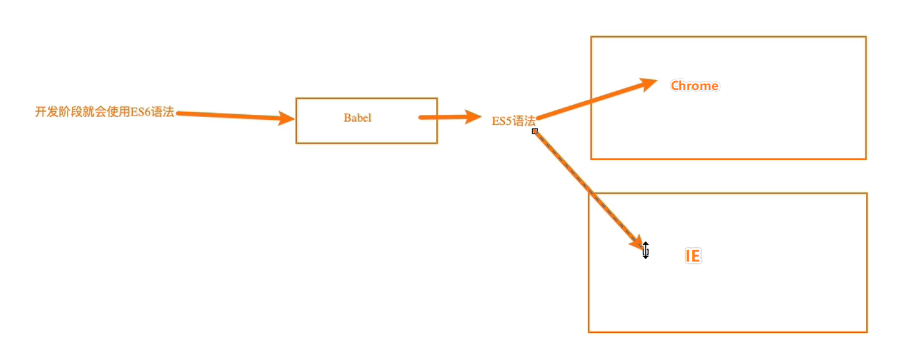
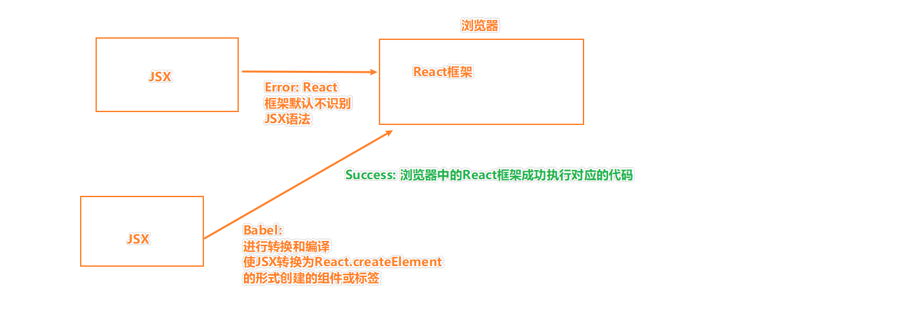

### 培训目的
带领大家认识react

### 培训大纲
- React产生的原因  
- React的特点   
- React的开发依赖   
- React的初体验   

### 一、React产生的原因
官方对它的解释：用于构建用户界面的 JavaScript 库

> React是FaceBook在2013年开源的框架

#### 1.1 使用原生开发产生的问题

- 需要去处理兼容性的问题，这是十分麻烦的，而且过多兼容性代码会导致代码的冗余
- 既要界面中的数据和交互，又需要频繁的去处理页面中的dom，十分的繁琐，且过多的重绘和回流（Reflow & Repaint）会减低页面的性能
- 数据和代码过于的分散，不统一，不利于代码的组织和维护，不利于生成良好的规范
- 在传统的开发模式中，我们过多的去操作界面的细节（无论是前端、iOS、Android）并且需要掌握和使用大量DOM的API，当然我们可以通过jQuery来简化和适配一些API的使用
- 数据（状态），往往会分散到各个地方，不方便管理和维护

#### 1.2 使用React的好处

- 以组件的方式去划分一个个功能模块 
- 组件内以jsx来描述UI的样子，以state来存储组件内的状态 
- 当应用的状态发生改变时，通过setState来修改状态，状态发生变化时，UI会自动发生更新
- 在React中,需要我们通过JavaScript代码的方式组织数据，转成JSX，因此React的灵活性高。其书写全部使用的都是JavaScript的方式去进行编写的，所以其显得更为灵活,但书写起来繁琐，对JavaScript基本功的要求高。
- 狭义上的React是指构建用户UI的js库，单纯的react不是一个完整的前端框架，一般说的React框架是包含了渲染器、路由、状态管理器、以及UI组件库等等的react全家桶。

#### 1.3 react的工作流程
- React包含了一个diff算法，diff算法在数据变动中，会以最小的代价，将数据重新映射成js对象，我们一般称这个js对象为virtual-dom。当我们有了virtual-dom的时候，再利用react-dom渲染器，将虚拟dom渲染成浏览器可识别渲染的Web dom。

### 二 、React的特点

#### 2.1 声明式编程
    需求：在页面中有一个显示一个Hello World，并有一个按钮,当点击按钮的时候，`Hello World` 修改为 `Hello React`

**原生JS --- 命令式编程(每一步操作，都是在告诉宿主环境一条条命令)**

    ```
    <p></p>
    <button>改变文本</button>

    <script>
    // 获取DOM节点
    const pEl = document.querySelector('p')
    const btnEl = document.querySelector('button')

    // 初始化文本
    let content = 'Hello World'
    pEl.innerHTML = content


    // 设置点击事件
    btnEl.addEventListener('click', () => {
        content = 'Hello React'
        pEl.innerHTML = content
    })
    </script>

    ```

**React实现 --- 声明式编程(我们只需要维护自己的状态，当状态改变时，React可以根据最新的状态去渲染我们的UI界面)**
```
<script src="https://unpkg.com/react@16/umd/react.development.js" crossorigin></script>
<script src="https://unpkg.com/react-dom@16/umd/react-dom.development.js" crossorigin></script>
<script src="https://unpkg.com/babel-standalone@6/babel.min.js"></script>

<div id="app"></div>

<script type="text/babel">
    let message = 'Hello World'

      function changeText() {
        message = 'Hello React'
          render()
      }

      function render() {
        ReactDOM.render( (
        <div>
          <p>{ message }</p>
          <button onClick={ changeText }>改变文本</button>
    </div>
      ), document.getElementById('app'))
      }

      render()
</script>

```


> 上图就是声明式编程的一个典型的描述    
> 我们可以预先定义好渲染界面的规则和方式（例如Vue，React，Angular）   
> 我们按照定义好的规则去维护我们的状态(数据)即可    
> 只要我们修改**state**后，可以手动（React）去执行这个渲染函数   
> 其会按照预先定义的规则去重新渲染页面    
    
#### 2.2 组件化开发

> 组件化开发页面目前前端的流行趋势，我们会讲复杂的界面拆分成一个个小的组件     
> 如上图： 这个页面就是一个App组件, 随后在根据一个个小的功能点去进行拆分为多个组件    
> 每一组件其本身也可以继续进行拆分为更小的组件   
> 随后将这些小的组件可以在进行合并，形成一个完整的应用   
   
#### 2.3 多平台适配
- 2013年，React发布之初主要是开发Web页面    
- 2015年，Facebook推出了ReactNative，用于开发移动端跨平台  
- 2017年，Facebook推出ReactVR，用于开发虚拟现实Web应用程序   


### 三、 React的开发依赖
#### 3.1开发React必须依赖三个库    
- react：包含react所必须的核心代码   
- react-dom：react渲染在不同平台所需要的核心代码   
- babel：将jsx转换成React代码的工具  

> 为什么会出现react-dom，在早期的react的版本中是没有react-dom这个概念的
> react-dom是伴随着react-native的诞生而产生的
> react包含了react和react-native所共同拥有的核心代码。
> react-dom针对web和native所完成的事情不同

> `web`端：`react-dom`会讲`jsx`最终渲染成真实的`DOM`，显示在浏览器中 

> `native`端：`react-dom`会讲`jsx`最终渲染成原生的控件（比如`Android`中的`Button`，`iOS`中的`UIButton`）

----
> Babel又名 Babel.js ,目前前端使用最为广泛的编译器   
> Babel的基本职能:将ES6的语法转换为绝大多数浏览器都可以识别的ES5的语法 
>    
> 以直接编写jsx（JavaScript XML）的语法，并且让babel帮助我们转换成React.createElement形式创建的组件对象来交给React和React-dom去进行解析和渲染，所以默认情况下使用React开发是不需要Babel的, 但是JSX是React.createElement的语法糖，所以一般在开发中使用的都是JSX的形式
> 


#### 3.2 引入React依赖的方式
- 方式一：直接CDN引入
- 方式二：下载后，添加本地依赖
- 方式三：通过npm管理（后续脚手架再使用）


在使用脚手架之前，暂时使用CDN引入的方式去进行引入   
```
<!-- ubpkg是一个和bootCDN类似的 前端公共CDN -->
<script src="https://unpkg.com/react@16/umd/react.development.js" crossorigin></script>
<script src="https://unpkg.com/react-dom@16/umd/react-dom.development.js" crossorigin></script>
<script src="https://unpkg.com/babel-standalone@6/babel.min.js"></script>
```
### 四、 React的初体验

#### 4.1 Hello World
```
<!-- 该文件向外暴露（导出）了一个对象 React -->
<script src="https://unpkg.com/react@16/umd/react.development.js" crossorigin></script>

<!-- 该文件向外暴露了一个对象 React-Dom -->
<script src="https://unpkg.com/react-dom@16/umd/react-dom.development.js" crossorigin></script>
<script src="https://unpkg.com/babel-standalone@6/babel.min.js"></script>

<div id="app"></div>

<!-- 为了使用JSX的语法，我们需要在script标签上声明type是 text/babel -->
<!-- 以便于使用该属性告知React，其是使用JSX编写的代码，需要使用Babel进行转换 -->
<!-- JSX是javascript的扩展，像Typescript,coffeeScript等一样，都是Javascript的语法糖，最终都要编译成JS执行 -->
<script type="text/babel">
      // 注意点:
      //  1. ReactDOM 中的DOM 这3个字母都需要进行大写

      //  2. render是ReactDOM上的一个方法，用以渲染界面
      //     其有3个参数
      //        @param1: 需要渲染的内容
      //        @param2: 挂载的对象
      //        @param3: callback 渲染完成后会被执行的callbeck （一般不进行使用）
      //

      // 3. React有且只能有一个root元素
      //    也就是render的第一个参数，有且只能有一个根元素（最外层元素），其下可以有任意多个子节点

      // 4. render的第二个参数表示的是需要将模板插入到哪一个DOM元素中，所以需要传入dom节点对象
      // 因为无论是通过class的方式还是id的方式去获取对应的DOM节点都是可以的
      // 一般使用id去获取对应的dom节点的形式居多
      
      // 5, render的第一个参数中既可以写标签，也可以写组件
      //  render函数渲染内容的话，如果被挂载的那个对象中本身存在一定的内容，其默认是会覆盖掉原本的内容的
      ReactDOM.render(<h2>Hello World</h2>, document.getElementById('app'), () => console.log('渲染完成了'))
</script>

```
#### 4.2 修改页面中的数据
需求：在页面中有一个显示一个Hello World，并有一个按钮,

 当点击按钮的时候，`Hello World` 修改为 `Hello React`

 **ES5的写法**
 ```
<script src="https://unpkg.com/react@16/umd/react.development.js" crossorigin></script>
<script src="https://unpkg.com/react-dom@16/umd/react-dom.development.js" crossorigin></script>
<script src="https://unpkg.com/babel-standalone@6/babel.min.js"></script>

<div id="app"></div>

<script type="text/babel">
    // 初始化数据
    let msg = 'Hello World'

    // 按钮被点击之后的事件绑定
    function changeContent() {
       msg = 'Hello React'
      // 修改完 数据以后其是不会立即去重新渲染的
      // 需要再次调用render函数以后才可以更新界面中的数据
      
      // 在实际开发过程中，一般是会使用ES6的类的写法去定义数据
      // 在任何情况下，都不推荐自己去手动调用render函数
       render()
     }

    // 定义渲染函数
     function render() {
      ReactDOM.render((
       <main>
        <h2>{ msg }</h2>
        <button onClick={ changeContent }>change content</button>
    </main>
     ), document.getElementById('app'))
     }

    // 界面初始化渲染
     render()
</script>

 ```

 **ES6的写法**

 ```
<script src="https://unpkg.com/react@16/umd/react.development.js" crossorigin></script>
<script src="https://unpkg.com/react-dom@16/umd/react-dom.development.js" crossorigin></script>
<script src="https://unpkg.com/babel-standalone@6/babel.min.js"></script>


<div id="app"></div>

<script type="text/babel">
    // 定义App组件
    class App extends React.Component {
        // 在构造函数中定义类的属性
        constructor() {
            // 调用父类的构造函数,进行父类的初始化
            super()
            // React中的数据定义在state中，其是一个对象
            this.state = {
                msg: 'Hello World'
            }
        }

        // 定义render函数
        render () {
            // 返回渲染的内容结果,也就是这里的返回值会被作为render的第一个参数
            return (
                <main>
                    {/* 这是在JSX中的注释方式 */}

                    {/* 在React中使用大括号语法在使用变量 注意是大括号,不是mustache */}
                    <div>{ this.state.msg }</div>
                    {/*
              1. 在React中使用方法的时候 事件名使用的是小驼峰，这是React中的函数，其本身对原生对应的js函数进行了一定程度的封装
                  例如 onClick是对原生onclick的封装

              2. 在React中使用方法时也是使用的大括号语法
                 在大括号中可以书写js表达式或者变量

              3. bind 是为了使函数调用的时候，其内部this被修改为当前实例对象
            */}
                    <button onClick={ this.changeContent.bind(this) }>change content</button>
                </main>
            )
        }

        // 在React中调用方法的时候，其执行的时候是没有办法获取this的，也就是this不是当前类的实例对象
        // 其调用的时候会 changeContent.call(undefined)
        changeContent() {
            // setState方法会在修改state中数据的时候，调用render方法，使其在修改数据的时候，去更新界面
            // 不再需要我们手动的去频繁的操作DOM
            this.setState({
                msg: 'Hello React'
            })
        }
    }

    // 渲染界面
    // 第一个参数在这里使用的就是之前定义的App组件
    ReactDOM.render(<App />, document.getElementById('app'))
</script>

 ```
