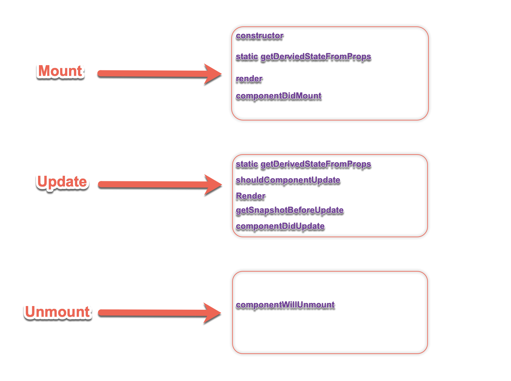
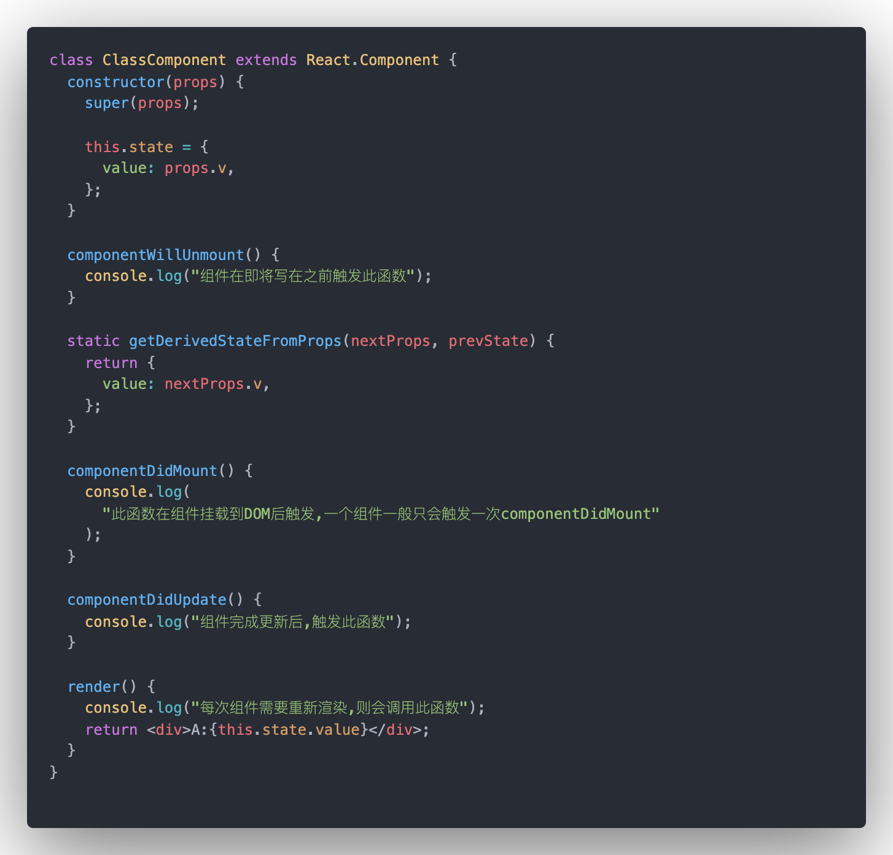
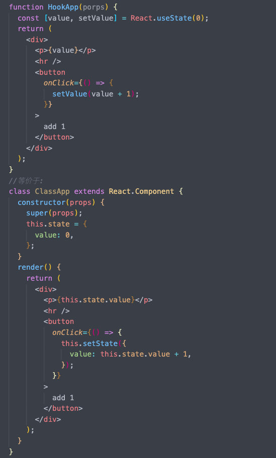
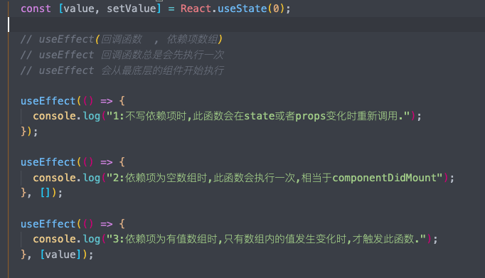
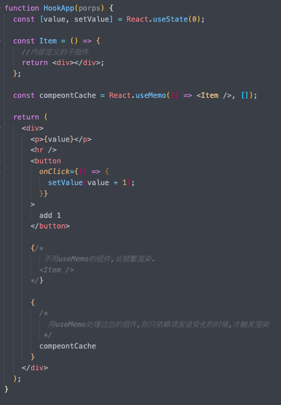

<!--
 * @Author: hf
 * @Date: 2020-09-03 23:20:05
 * @LastEditTime: 2021-12-02 14:48:03
 * @LastEditors: hf
-->
react知识体系培训提纲
###  培训目的
通过脚手架工具，快速掌握react开发流程，并开发一个demo实例
### 培训大纲
> 1. react 基础知识介绍
> 2. 环境安装，nodejs、 npm 、create-react-app
> 3. create-react-app 配置介绍
> 4. 搭建一个小页面
> 5. 常用三方库的使用
>   - [ant design](https://ant-design.gitee.io/index-cn)
>   - [svg注入](libs/svg注入.md) 
>   - npm 库的使用
> 6. 组件化，组件通信
> 7. 路由配置，实现多页面跳转
> 8. 打包发布

说明：本培训提纲基于react v16.13.1整理。
	
相关官网地址：   
> react：        https://zh-hans.reactjs.org    
> antd：   	   https://ant-design.gitee.io/index-cn     
> redux： 	   https://www.redux.org.cn    
> react-router-dom： https://reactrouter.com/web/guides/quick-start

**一、脚手架**

#### 1) create-react-app脚手架介绍		
	
-	cra的介绍：https://github.com/facebook/create-react-app
-	cra的安装和简易配置     
		npm install -g create-react-app
-	项目启动及打包  
		npm run start   
		npm run build

#### 2)	组件及组件的状态和生命周期介绍(代码示例)

- react组件：将一段可以复用的有数据逻辑的react代码封装成一个类或者一个函数，这个类或者函数就可以称之为组件。组件有输入（非必须）、输出（必须）以及自身状态（非必须），分别对应props、render、state。

- 在类声明组件中，可以创建一个继承于React.Component的类。

组件在挂载到页面上时，会按照不同的时间节点，触发不同的函数，这些函数叫React组件的生命周期函数。
 
代码示例：
        	
        	
	
#### 3)	react的hook语法介绍

- hook概念：
		以函数是申明的组件，这种组件可以在不编写 class类申明组件 的情况下使用 state 以及其他 React 特性。
	
		代码示例：
    	
	

	
- 常用的几个hook api介绍：   
		React内置了一些hook函数，这些函数均以use开头。
	- **useState**     
		状态存储，类似于state和setState
		
	- **useEffect**    
		监听依赖的变化并执行相应的操作。  
            
		代码示例：  
		
	- **useMemo**      
		监听依赖的变化并执行相应的操作，但是允许有返回值，返回值一般是一个组件，从而达到性能优化。  
            
		代码示例：   
        

#### 4)	react常用第三方库使用介绍

> - UI库：ant-design   
	> antd 是基于 Ant Design 设计体系的 React UI 组件库，是一些封装好的开箱即用的react组件。
	
> - 状态管理工具：redux     	   
	> Redux 是 react的状态容器，提供可预测化的状态管理。由于react是单向数据流，所以redux将所有数据放在顶层，然后通过高阶组件逐级	下发至不同子组件，实现状态共享。但是由于我们之前在redux实践上犯了很多错，比如在action里调用请求，却又不做异常处理，又比如在redux里直接存取数据而不是状态等等。
		现在基于hook语法有更好的解决方案：useContext()
	
> - 路由组件：react-router
	> React Router保持UI与URL同步。我们使用的更多的是react-route-dom，一个基于react-router封装的库。

> - 数据请求：Axios
	> 基于XMLHttpRequest和node.http模块封装的http请求工具，能在浏览器端和服务端均可使用的一个请求工具，封装了Promise对象，需要对Promise要有一定的了解。

#### 5) 代码实现

- 根据文档配置路由，实现两个页面
- 框架
>menu layout
- table 
> 分页请求，筛选请求
- 表单
> input button  
  
