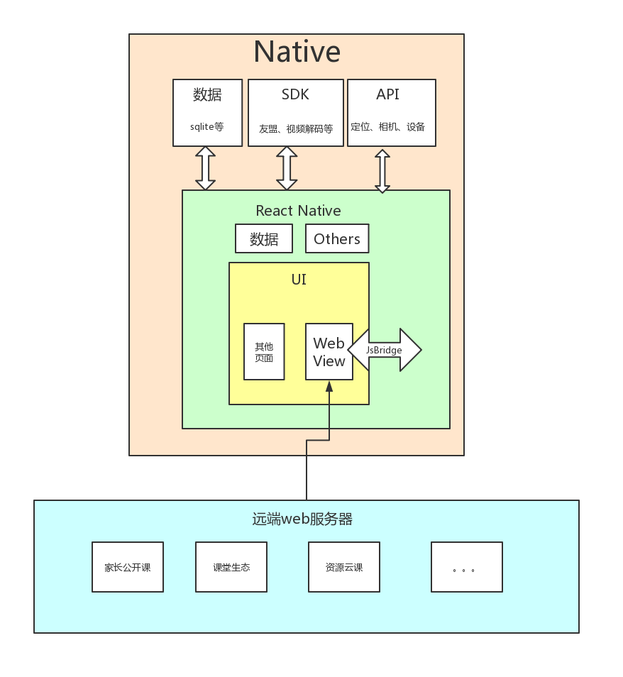

### 培训技术点
- [安卓环境](./../android/安卓环境搭建.md)
- [ios环境](./../ios/ios环境搭建.md)
- 介绍JF-BEMAS （H5接入api）
### 培训目的
- 熟悉本公司框架，并在本公司app框架上进行开发
- 核心组件与原生组件、ant design mobile/RN 使用
- svg 处理及集成
- 持久化策略
- 调试

### 架构
- [react-native中文网](https://reactnative.cn/docs/getting-started/)
- [react-native英文网](https://reactnative.dev/)
- [react-nativeUI库-AntdRN](https://rn.mobile.ant.design/index-cn)

#### 一.安卓环境搭建
链接 ： [https://reactnative.cn/docs/getting-started](https://reactnative.cn/docs/getting-started)
#### 二.android studio工具使用
> 1.sdk路径重新规划  
> 2.rebuild 项目依赖    
> 3.debug

#### 三.介绍JF-BEMAS

##### 1.APP整体结构

##### 2.使用技术

###### 2.1外壳程序

门户项目外壳程序使用React Native（以下简称RN），RN从语法以及开发模式上和我们现有的web开发基本相同,学习成本低。所以在保证了更高的开发和学习效率的同时又能提供接近Native App的体验以及系统层调用、三方SDK接入等能力。

###### 2.2内嵌系统

内嵌的各个子系统通过webview的方式接入，每个webview内运行的是webapp，在需要使用到Native功能时通过jsbridge完成RN端和web端的通信。

###### 2.3消息推送

消息推送集成友盟消息SDK。

###### 2.4分享

分享功能使用系统分享api和友盟分享sdk两种方式。

###### 2.5流媒体解码

流媒体解码采用金山云解码sdk，支持rtmp、rtsp、hls、http等主流的流媒体实现方式，支持录播和点播功能。当子系统中的业务包含直播和录播视频播放时，可以跳转到外壳程序提供的播放页面进行视频播放。

###### 2.6数据管理

针对接口数据管理，RN外壳和web端统一使用react-redux进行数据状态管理。数据持久化存储RN端使用AsyncStorage

###### 2.7应用升级

外壳程序提供两种升级方。

1. 当有重大版本更新时，更新弹窗强制弹出，用户跳转到应用软件商店强制更新App。
2. 小版本更新使用热更新的方式，用户在使用过程中在后台自动更新，下次打开时自动启用更新，用户无感知。

内嵌系统通过更新远端部署的web包即可完成升级。

版本检测 版本验证

###### 2.8用户数据管理

门户APP登录后统一储存用户token，当跳转到各个子系统时通过url传输token，子系统根据token来验证用户信息。

获取用户信息

用户持久化验证

###### 2.9WebView通信

请看[WebView对接文档](http://10.10.0.95/books/react-native-%E7%9F%A5%E8%AF%86/page/webview%E5%AF%B9%E6%8E%A5%E6%96%87%E6%A1%A3)

