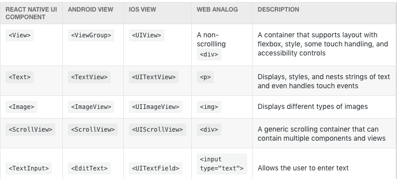

#### 培训目的
- 核心组件与原生组件、ant design mobile/RN 使用
- svg 处理及集成
- 持久化策略
- 调试

#### 核心组件与原生组件
 
- flatList
- SectionList
- React-Native 发送和接收事件DeviceEventEmitter

#### ant design mobile/RN 使用
与react应用antd类似    
官方地址：[https://mobile.ant.design/index-cn](https://mobile.ant.design/index-cn)
#### svg 处理及集成

在React Native的项目中要使用svg图标，我们可以使用 [react-native-svg](https://github.com/react-native-community/react-native-svg) 这个插件。由于我使用的create-react-native-app 的方法初始化项目，项目中默认是带了这个插件的，所以不需要另外进行安装。若使用其他方法初始化，可以参照文档自行安装。

在默认情况下，`react-native-svg`只提供了几个简单的图形。所以我们在使用自定义的svg图标时，需要使用Path对svg图标中的path进行绘制。

例如：
```
import React from "react";
import Svg, { Path } from "react-native-svg";
const Tianjia = props => (
  <Svg width={60} height={60} {...props}>
    <Path
      d="M12.64 26.45h34.7a2.648 2.648 0 0 1 2.65 2.65v.7a2.655 2.655 0 0 1-2.65 2.65h-34.7a2.648 2.648 0 0 1-2.65-2.65v-.7a2.642 2.642 0 0 1 2.65-2.65zM29.66 10h.7a2.642 2.642 0 0 1 2.65 2.65v34.7A2.648 2.648 0 0 1 30.36 50h-.7a2.655 2.655 0 0 1-2.65-2.65v-34.7A2.648 2.648 0 0 1 29.66 10z"
      fill="#6b400d"
      fillRule="evenodd"
    />
  </Svg>
);

export default Tianjia;
```

这样虽然解决了问题，但若存在多个图标，一个个绘制不免有些麻烦。为此，我们可以使用一个批处理工具 [svgr](https://github.com/smooth-code/svgr)。该工具能将svg图标批量生成react 或 react native组件。生成后的组件，通过import引用，即可展示图标。 

安装方式：`npm install @svgr/cli -g`

该工具的使用方法也很简单，仅需一行命令:`svgr --native  图标或图标文件夹路径 --out-dir 期望输出的路径`，我们就将svg图标生成了react-native的组件。我们需要展示图标时，只需要通过import引入该组件，并为组件设置宽高，就能显示该图标。

```
// 示例
import Xuexiao from './../static/svg/Xuexiao'

<Xuexiao
  height={30}
  width={30}
/>

```
#### 持久化策略
[react-native-storage](https://www.npmjs.com/package/react-native-storage)

#### 调试
演示: [react-native 自带](https://reactnative.cn/docs/debugging)
#### 路由
[react-navigation](https://www.jianshu.com/p/f39f020197ef)